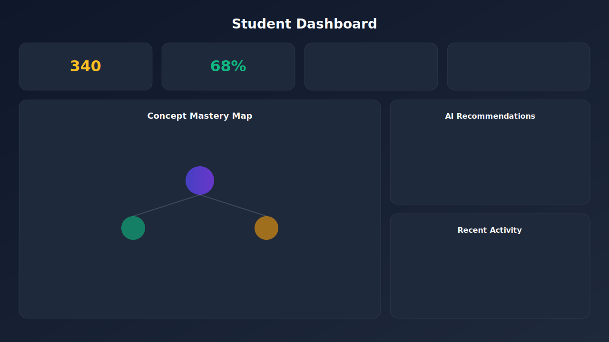
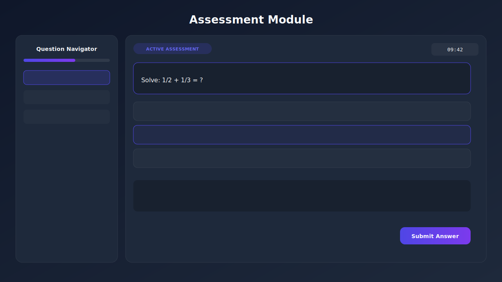

# GapLearning AI

<div align="center">


**AI-Powered Adaptive Learning Platform**

*Identify knowledge gaps · Generate personalized assessments · Map concepts · Recommend learning paths*

[](https://react.dev/)
[](https://www.typescriptlang.org/)
[](https://vitejs.dev/)
[](https://tailwindcss.com/)
[](https://ai.google.dev/)

[Live Demo](#) · [Student Portal](/student) · [Teacher Portal](/teacher) · [Report Bug](https://github.com/issues)

</div>

---

## Overview

**GapLearning AI** is a production-quality educational SaaS platform that uses artificial intelligence to diagnose *why* students make mistakes — not just *what* they got wrong. Built for internships, hackathons, LinkedIn portfolios, and resume showcases.

The platform adapts in real time: it detects misconceptions, unlocks prerequisite concepts, guides students through Socratic tutoring, and gives teachers class-wide analytics with AI-generated remediation strategies.

## Features

### For Students
- **AI Gap Detection** — Identifies specific misconceptions from student work and answer choices
- **Adaptive Assessments** — Dynamic difficulty with progress tracking, timer, and question navigation
- **Interactive Concept Maps** — Visual knowledge graphs with dependency lines and mastery indicators
- **Socratic AI Tutor** — Conversational guidance that helps students discover errors themselves
- **Gamification** — XP, levels, streaks, and achievement badges
- **Personalized Learning Paths** — AI-recommended next steps based on diagnostic results

### For Teachers
- **Class Analytics Dashboard** — Student counts, mastery rates, and gap frequency
- **Performance Charts** — Line, bar, and pie charts powered by Recharts
- **Weak-Topic Detection** — At-risk student lists with specific misconception details
- **AI Teaching Suggestions** — Actionable remediation strategies per subject
- **Worksheet Generator** — Targeted practice sheets for specific misconceptions
- **Export Reports** — Downloadable class performance summaries

## Architecture

```
┌─────────────────────────────────────────────────────────────────┐
│                        GapLearning AI                           │
├─────────────────────────────────────────────────────────────────┤
│  Landing Page          Student Portal         Teacher Portal    │
│  ┌──────────┐         ┌──────────────┐       ┌──────────────┐  │
│  │ Hero     │         │ Dashboard    │       │ Analytics    │  │
│  │ Features │         │ Concept Map  │       │ Charts       │  │
│  │ Benefits │         │ Assessment   │       │ AI Suggest.  │  │
│  │ Reviews  │         │ AI Tutor     │       │ Worksheets   │  │
│  └──────────┘         └──────┬───────┘       └──────┬───────┘  │
│                              │                       │          │
│                    ┌─────────▼───────────────────────▼────────┐ │
│                    │           Services Layer (ai.ts)           │ │
│                    │  · Adaptive Question Gen  · Diagnosis      │ │
│                    │  · Socratic Chat          · Worksheets     │ │
│                    └─────────┬────────────────────────────────┘ │
│                              │                                   │
│                    ┌─────────▼─────────┐                          │
│                    │  Gemini 2.5 Flash │  (optional, API key)    │
│                    │  Mock Fallback    │  (offline demo mode)    │
│                    └───────────────────┘                          │
└─────────────────────────────────────────────────────────────────┘
```

## Tech Stack

| Layer | Technology |
|-------|-----------|
| Framework | React 19 + TypeScript |
| Build Tool | Vite 8 |
| Styling | Tailwind CSS 4 |
| Animation | Framer Motion |
| Charts | Recharts |
| Icons | Lucide React |
| Routing | React Router DOM |
| AI | Google Gemini 2.5 Flash |
| Deployment | Vercel |

## Design System

| Token | Value |
|-------|-------|
| Primary | `#4F46E5` |
| Secondary | `#7C3AED` |
| Background | `#0F172A` |
| Surface | `#1E293B` |
| Text | `#F8FAFC` |

UI patterns include glassmorphism cards, gradient backgrounds, skeleton loading states, empty states, and responsive layouts for desktop, tablet, and mobile.

## Installation

### Prerequisites
- Node.js 18+
- npm or yarn

### Setup

```bash
# Clone the repository
git clone https://github.com/yourusername/gap-learning-ai.git
cd gap-learning-ai

# Install dependencies
npm install

# Start development server
npm run dev
```

Open [http://localhost:5173](http://localhost:5173) in your browser.

### Optional: Enable Live AI

1. Get a [Gemini API key](https://aistudio.google.com/apikey)
2. Open Student or Teacher Portal
3. Click the settings toggle and paste your API key
4. The key is stored locally in your browser — never sent to any backend

### Build for Production

```bash
npm run build
npm run preview
```

## Screenshots

| Landing Page | Student Dashboard |
|:---:|:---:|
|  |  |

| Assessment Module | Concept Mapping |
|:---:|:---:|
|  |  |

| Teacher Dashboard |
|:---:|
|  |

## Folder Structure

```
gap-learning/
├── public/
│   └── screenshots/          # App screenshot placeholders
├── src/
│   ├── components/
│   │   ├── assessment/       # Quiz interface, timer, summary
│   │   ├── concept-map/      # Interactive knowledge graph
│   │   ├── dashboard/        # Analytics cards, activity timeline
│   │   ├── landing/          # Hero, features, testimonials
│   │   ├── layout/           # Navbar, footer
│   │   ├── teacher/          # Teacher dashboard & charts
│   │   └── ui/               # Design system (Button, Card, Badge…)
│   ├── data/                 # Mock data (testimonials, activity)
│   ├── pages/                # Route-level page components
│   ├── services/             # AI service layer (Gemini + fallbacks)
│   ├── types/                # Shared TypeScript types
│   └── utils/                # Utility helpers
├── vercel.json               # SPA routing for Vercel
├── vite.config.ts
└── README.md
```

## Deployment on Vercel

1. Push your repository to GitHub
2. Import the project at [vercel.com/new](https://vercel.com/new)
3. Vercel auto-detects Vite — no extra configuration needed
4. The included `vercel.json` handles SPA client-side routing

```bash
# Or deploy via CLI
npm i -g vercel
vercel
```

> **Note:** The Gemini API key is entered client-side by users. For production, consider a serverless proxy to protect API keys.

## Future Roadmap

- [ ] User authentication (Firebase / Auth0)
- [ ] Persistent progress with cloud database (Supabase)
- [ ] Real-time collaborative concept maps
- [ ] Mobile app (React Native)
- [ ] Multi-language support
- [ ] LMS integrations (Google Classroom, Canvas)
- [ ] Advanced analytics with ML-based gap prediction
- [ ] Parent/guardian progress reports

## Contributing

Contributions are welcome! Please follow these steps:

1. Fork the repository
2. Create a feature branch: `git checkout -b feature/amazing-feature`
3. Commit your changes: `git commit -m 'Add amazing feature'`
4. Push to the branch: `git push origin feature/amazing-feature`
5. Open a Pull Request

### Development Guidelines
- Use TypeScript for all new files
- Follow existing component patterns in `src/components/ui/`
- Keep components focused and reusable
- Test responsive layouts at mobile, tablet, and desktop breakpoints
- Run `npm run lint` before submitting

## License

MIT License — feel free to use this project for portfolios, hackathons, and learning.

---

<div align="center">

Built with ❤️ for the future of personalized education

</div>
