# GapLearning

[](https://github.com/tanmaytyagii/Gap-Learning/actions/workflows/ci.yml)


**An adaptive learning app that finds the gaps in what you know, explains why they are gaps, and schedules the practice and reviews that close them.**

Most quiz tools tell you *that* you got something wrong. GapLearning tells you *why*: every wrong answer is traced to a named misconception, each knowledge gap carries a severity score you can audit line by line, and practice, spaced review, and progress all come from one explainable mastery model. It is local-first (your data stays in your browser), and AI is optional, labeled, and never in charge of the decisions.

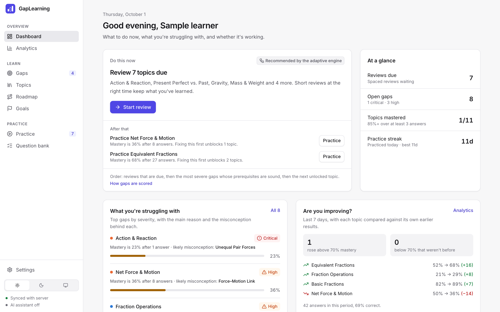

## Contents

1. [The problem](#the-problem)
2. [How it works](#how-it-works)
3. [Architecture](#architecture)
4. [Key features](#key-features)
5. [The adaptive engine](#the-adaptive-engine)
6. [The misconception model](#the-misconception-model)
7. [Gap scoring](#gap-scoring)
8. [Spaced review](#spaced-review)
9. [AI architecture](#ai-architecture)
10. [Security](#security)
11. [Performance](#performance)
12. [Testing](#testing)
13. [Screenshots](#screenshots)
14. [Local development](#local-development)
15. [Environment variables](#environment-variables)
16. [API overview](#api-overview)
17. [Project structure](#project-structure)
18. [Limitations](#limitations)
19. [Roadmap](#roadmap)

## The problem

A score of 60% says almost nothing about what to do next. Two learners with the same score can have entirely different problems: one adds denominators when adding fractions, the other never learned equivalent fractions. Generic practice treats them the same, so the real cause survives.

GapLearning is built around four questions a learner should always be able to answer:

- **What am I weak at?** Topics ranked by a severity score.
- **Why does the system think so?** Every point of that score is shown with its reason.
- **What should I do now?** One recommended next step, chosen by documented rules.
- **Am I improving?** Each topic compared with its own past, not a blended average.

## How it works

```
Assess → Detect gap → Understand → Practice → Review → Measure
```

1. **Assess.** An adaptive diagnostic walks the prerequisite graph: a wrong answer steps back to the weakest prerequisite at lower difficulty, and a secure answer moves on to a dependent topic.
2. **Detect.** Each answer is stored as evidence. Mastery, status, gaps, and review dates are all derived from that evidence by pure functions.
3. **Understand.** The misconception behind a wrong answer is named, with a fix, a one-sentence key idea, and a full lesson.
4. **Practice.** Targeted sets adapt difficulty after every answer. A Socratic tutor is available, either AI or built-in hints.
5. **Review.** A spaced-repetition schedule brings topics back just before you would forget them, and says why each one is due.
6. **Measure.** Mastery history per topic, gaps closed versus opened, and analytics with table views.

## Architecture

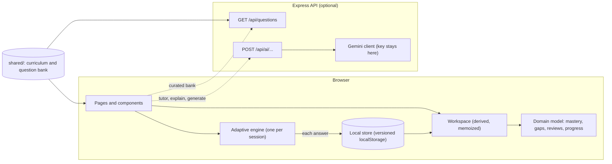
```mermaid
flowchart LR
  subgraph Browser
    UI["Pages and components"] --> WS["Workspace (derived, memoized)"]
    WS --> D["Domain model: mastery, gaps, reviews, progress"]
    UI --> E["Adaptive engine (one per session)"]
    E -->|"each answer"| S[("Local store (versioned localStorage)")]
    S --> WS
  end
  subgraph Server["Express API (optional)"]
    Q["GET /api/questions"]
    AI["POST /api/ai/..."] --> G["Gemini client (key stays here)"]
  end
  C[("shared/: curriculum and question bank")] --> UI
  C --> Q
  UI -. "curated bank" .-> Q
  UI -. "tutor, explain, generate" .-> AI
```

- **Local-first learner data.** Answers, notes, goals, and custom topics live in `localStorage`, validated on load and on import, with JSON export. No account is needed, and a static deployment works fully.
- **Attempts are the single source of truth.** Mastery, status, gaps, review schedules, streaks, and progress are recomputed from raw answers, so nothing can drift out of sync.
- **One curriculum for client and server.** `shared/` holds the subjects, topics with lessons, the misconception catalog, and the curated question bank. The client bundles them as an offline fallback; the API validates authored questions against them.
- **The engine decides; AI assists.** Ranking, recommendations, mastery, and scheduling are deterministic. AI only writes explanations, Socratic replies, and draft questions.

More detail: [docs/ARCHITECTURE.md](docs/ARCHITECTURE.md).

## Key features

- **Dashboard** that leads with the engine's recommended next step and the reason for it, then what you're struggling with and whether you're improving.
- **Gap analysis** for every weak topic: the score on its severity scale, the triggers that make it a gap and what would clear each one, the modifiers that rank it, the misconception behind it, and the understand, practice, review, measure loop.
- **Adaptive diagnostics and practice** with progressive feedback: verdict, misconception, key idea, collapsible worked solution, and next step. Keyboard shortcuts: `1`–`6` to choose, `H` for a hint, `Enter` to submit or continue.
- **Spaced review** that explains each due topic and shows how a session moved its schedule.
- **Topics** with lessons, notes (searchable), resources, a manual status that holds until your next answer, priority, and a confidence self-rating that flags over-confidence.
- **Your own topics and questions**, held to the same validation rules as curated content.
- **Goals** with deadlines and on-track/at-risk pacing; a **roadmap** of prerequisites; **analytics** with a table view for every chart.
- Light and dark themes, a responsive layout down to 390px, and full keyboard support.

## The adaptive engine

`src/adaptive/` is a set of small engines behind a facade. Each session gets its own instance with its dependencies injected (knowledge graph, questions, misconception lookup, random source), so there is no global state and everything is testable.

| Mode | Behavior |
|---|---|
| Diagnostic | Starts at the first topic you have not mastered. After an error it steps back to the weakest prerequisite at lower difficulty. After an easy success it raises difficulty, and after a harder success it advances to an untested dependent topic whose prerequisites look secure. |
| Practice | Stays on one topic; difficulty moves up after a correct answer and down after a mistake. |
| Review | Rotates through due topics, pitching each from its last result. |

The engine never repeats a question within a session while unseen ones remain, and caps sessions at the number of available questions. Questions whose topic is missing from the graph are ignored rather than crashing a session (a bug in the original prototype, now covered by a regression test).

**Mastery** per topic is recency- and difficulty-weighted with a neutral prior:

```
mastery = (Σ wᵢ · correctᵢ + 0.5) / (Σ wᵢ + 1)      wᵢ = difficulty weight × 0.85^age
```

Difficulty weights are easy 0.8, medium 1, and hard 1.2. `age` is how many later answers there are on the same topic, so recent evidence dominates and improvement shows. *Mastered* requires at least 85% over at least 3 answers.

## The misconception model

The curated bank has **66 questions** across 3 subjects and 11 topics, with two questions per difficulty for every topic. **194 of the 198 wrong options** are tagged with one of **60 catalogued misconceptions**. Each misconception has:

- a title;
- a third-person description, used on gap pages;
- second-person feedback, shown right after the mistake;
- a concrete remedy.

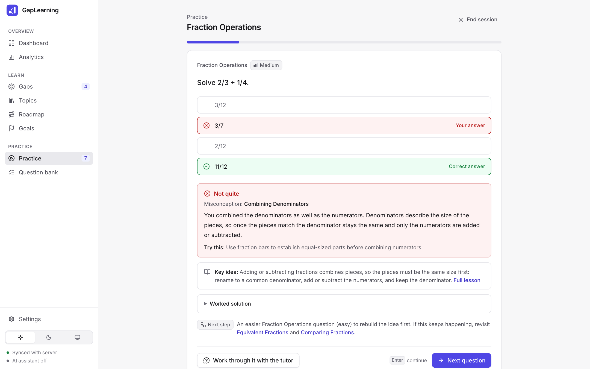

Options are displayed in a shuffled order seeded per session and question. The content audit found the correct answer listed first in 49 of 66 questions, so authoring order must never be a cue. Answers are matched by text, so diagnosis is unaffected. See [docs/CONTENT_AUDIT.md](docs/CONTENT_AUDIT.md) for the full content review.

## Gap scoring

A topic becomes a gap when a **trigger** applies. **Modifiers** then adjust its rank. The score is the sum of the points shown, capped to 0–100.

| Kind | Rule | Points |
|---|---|---|
| Trigger | Mastery below 70% | `round((70 − m)/70 × 45) + 10` |
| Trigger | The same misconception twice in the last 10 answers (while mastery < 85%) | +10 |
| Trigger | Self-rated 1 or 2 out of 5 with fewer than 3 answers | +35 / +25 |
| Trigger | Untested prerequisite of a topic below 50% | +20 |
| Modifier | Blocks non-mastered dependent topics | +5 each, max +20 |
| Modifier | Rated 4–5 but mastery below 60% (over-confidence) | +10 |
| Modifier | Your priority: high or low | +15 / −10 |

Severity bands: critical ≥ 65, high ≥ 45, medium ≥ 25, otherwise low. For each trigger the app also states what would clear it. For example, "about 5 correct medium answers in a row" is computed by running hypothetical answers through the same mastery formula.

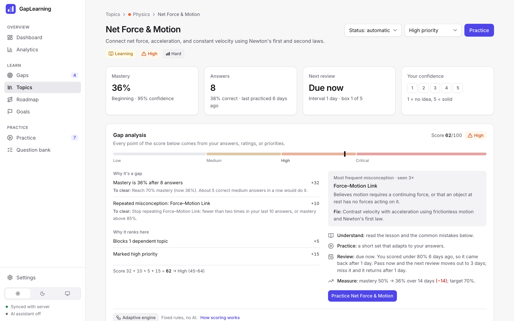

## Spaced review

A Leitner schedule is derived from attempts (`src/domain/review.ts`). Each session on a topic is a sitting, and 80% or more passes.

- **Promotion:** passing on or after the due date moves the topic up a box. The intervals are 1, 3, 7, 14, and 30 days.
- **Reset:** failing sends it back to box 1.
- **Early reviews** never promote, so cramming can't skip intervals.

Review sessions say why each topic is due, for example "You passed it 4 days ago, so it was scheduled 3 days later. Pass now and the next review moves out to 7 days." The session summary shows how each interval changed.

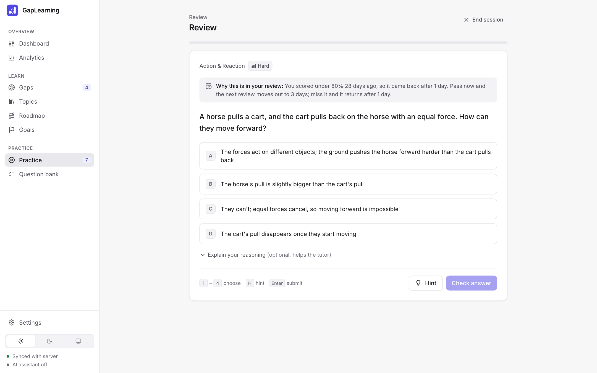

## AI architecture

AI features are optional and run only when the API server has `GEMINI_API_KEY`.

| Feature | What AI does | What stays deterministic |
|---|---|---|
| Tutor | Socratic replies after a wrong answer, without giving the answer away | Diagnosis, the misconception shown, and the next question |
| Explain | A short explanation that targets your own misconceptions | The lesson, gap score, and recommendations |
| Generate questions | Drafts multiple-choice questions, each wrong option with a misconception | Validation, duplicate detection, and what gets saved |

- **Keys never reach the browser.** The server calls Gemini with the key in a header, never in a URL.
- **Learner text is data, not instructions.** It is wrapped in `<data>` tags, and prompts tell the model to ignore instructions inside it.
- **Generated questions are checked twice.** The server requests schema-constrained JSON and discards malformed items. The browser then runs the same validator used for hand-written questions, including a duplicate-wording check against the bank, and invalid items cannot be selected.
- **AI output is always labeled.** An "AI-generated" badge appears on tutor replies, explanations, notes saved from them, and generated questions. Engine output carries an "Adaptive engine" badge instead.
- **Without AI, nothing breaks.** The tutor falls back to built-in hints and says so.

## Security

- The AI key stays on the server. AI routes are rate limited per IP, with `RateLimit-*` and `Retry-After` headers.
- Request bodies are capped at 64 KB and validated field by field. Errors are JSON with no stack traces.
- Question authoring (`POST`/`PUT`/`DELETE /api/questions`) requires `ADMIN_TOKEN`, compared in constant time. Without it, authoring is disabled.
- CORS is off unless `CORS_ORIGIN` lists allowed origins.
- Every response sets `nosniff`, `X-Frame-Options: DENY`, `Referrer-Policy`, COOP, and `Permissions-Policy`. The served app also gets a strict Content Security Policy, with no inline scripts.
- Stored and imported data is validated record by record. Resource links must be `http(s)`, and AI Markdown is rendered without `innerHTML`.
- `npm audit` reports 0 vulnerabilities.

## Performance

Measured on the production build:

| Route | JavaScript on first load |
|---|---|
| Landing page | 451 KB (9 files) |
| Dashboard | 470 KB (16 files) |
| Analytics (loads the chart library) | 802 KB (14 files) |

The original prototype shipped one 860 KB bundle to every route, so first load is now about 48% smaller on the landing page. The gains come from route-level code splitting, loading Recharts only where charts appear (including lazily on a topic's Progress tab), and removing unused dependencies. Sizes are uncompressed: the main chunk is 102 KB gzipped, and production hosts normally compress responses.

## Testing

| Suite | Tool | Tests | Covers |
|---|---|---|---|
| Engine, domain, store | Vitest | 61 | Content integrity, adaptive modes, mastery, gap scoring and clearance, reviews, progress, question validation, import validation, option shuffling |
| API | `node:test` | 21 | Validation, admin auth, persistence, security headers, the Gemini proxy (stubbed), rate limiting |
| Browser | Playwright | 43 | Every main flow on desktop, plus 390px mobile: onboarding, practice, diagnostic, review, gaps, topics, questions, goals, analytics, roadmap, settings, AI, routing, keyboard, and focus |

Browser tests run against the production build served by the real Express app. AI is answered by a deterministic stub (`e2e/support/gemini-stub.cjs`), so no keys are needed. Tests decide right and wrong answers by looking the question up in the bank, which keeps them deterministic even though the engine breaks ties randomly. Every test also fails on any browser console error.

```bash
npm test             # unit + API tests
npm run test:e2e     # build, then Playwright (first time: npx playwright install chromium)
npm run check        # lint + typecheck + unit/API tests + build
```

CI (`.github/workflows/ci.yml`) runs lint, typecheck, tests, and the build on Node 20.19, 22, and 24, and Playwright on Node 22.

## Screenshots

| Gaps, ranked with reasons | Analytics |
|:---:|:---:|
| 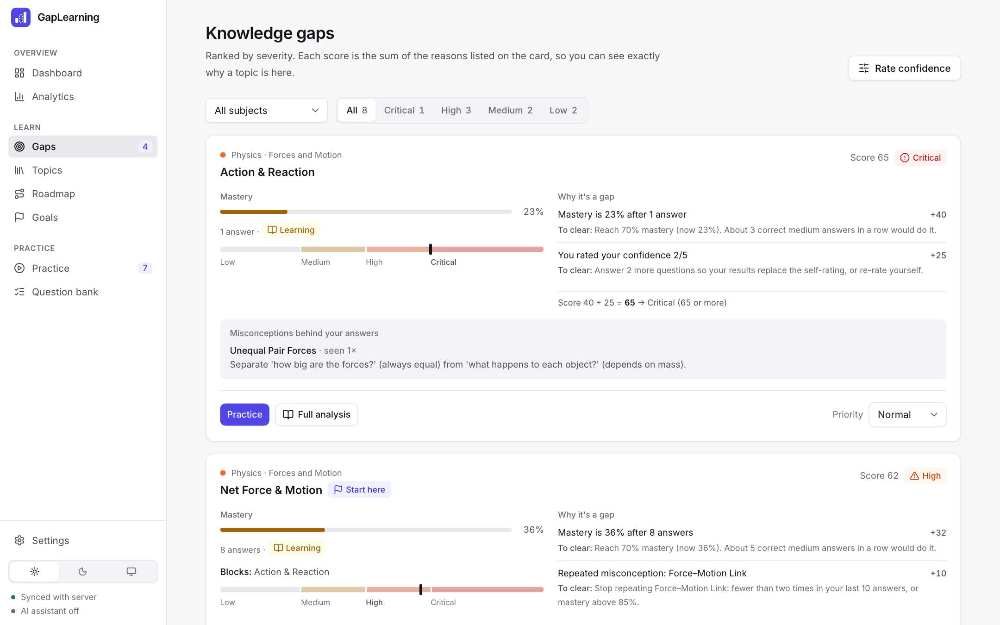 | 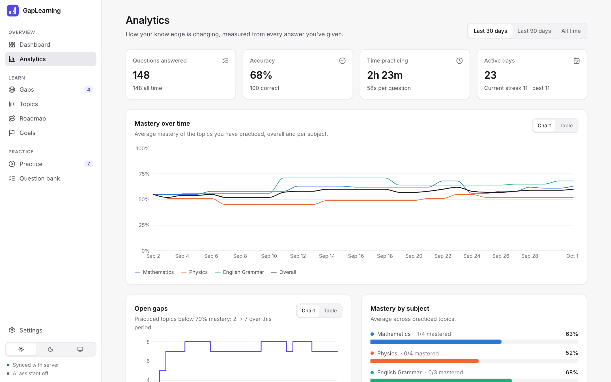 |
| **Prerequisite roadmap** | **Dark theme** |
| 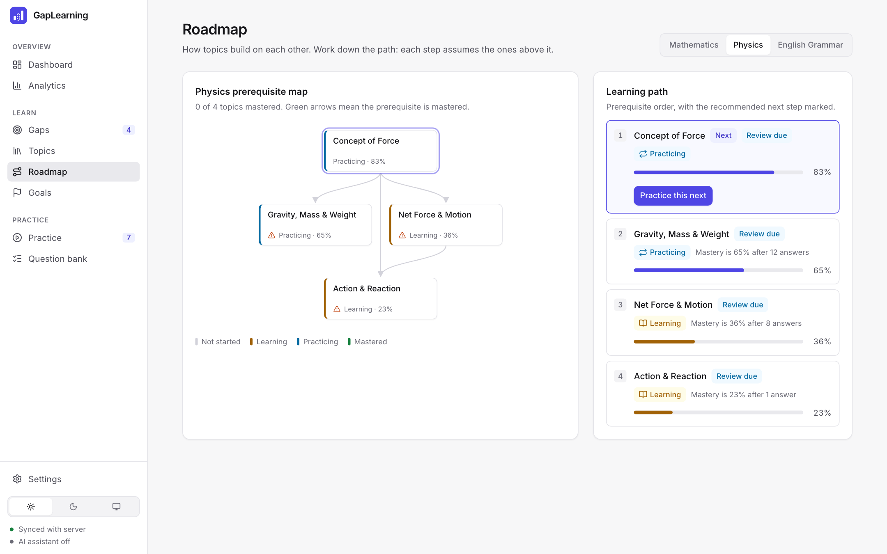 | 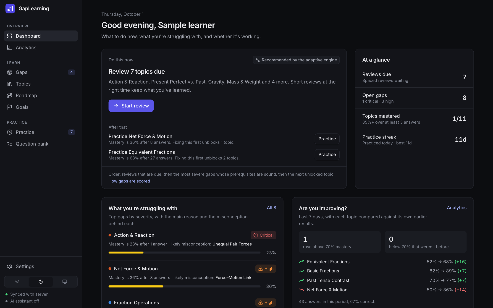 |
| **Landing page** | **Mobile (390px)** |
| 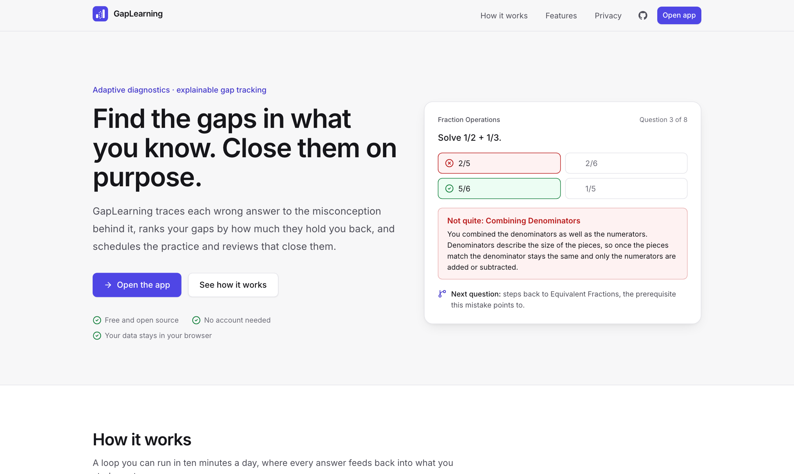 | 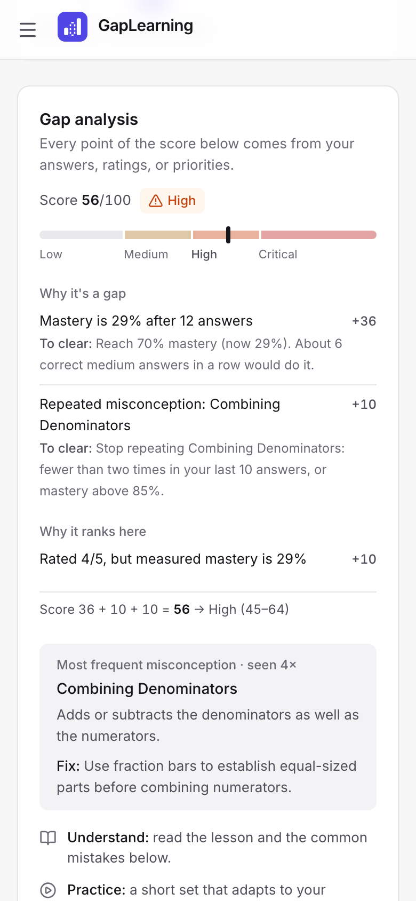 |

Screenshots use the built-in sample workspace: four weeks of practice generated by simulating a learner answering real questions through the real engine. Load it from the dashboard, and clear it from the banner.

## Local development

Requires Node.js 20.19 or later (`.nvmrc` pins 22).

```bash
git clone https://github.com/tanmaytyagii/Gap-Learning.git
cd Gap-Learning
npm install
npm run dev
```

`npm run dev` starts the API on <http://localhost:8787> and the app on <http://localhost:5173>, which proxies `/api` to the API. Open the app and choose **Explore with sample data** for a populated workspace, or take a diagnostic.

To enable AI, copy `.env.example` to `.env` and set `GEMINI_API_KEY`. Both servers read the same file.

| Command | What it does |
|---|---|
| `npm run dev` | API and app together |
| `npm run dev:web` / `npm run dev:server` | Just the app (works offline with the bundled bank) / just the API |
| `npm run build` | Type-check and build into `dist/` |
| `npm start` | Production server: the API, which also serves `dist/` |
| `npm test` | Unit and API tests |
| `npm run test:e2e` | Build, then the Playwright suite |
| `npm run lint` / `npm run typecheck` | ESLint / TypeScript (strict) |
| `npm run check` | Everything CI's check job runs |

**Deploying.** On a single Node host (Render, Railway, Fly.io), build with `npm install && npm run build` and start with `npm start`. Alternatively, deploy the frontend to Vercel (`vercel.json` is included) with `VITE_API_BASE_URL` pointing at a separately hosted API, and set `CORS_ORIGIN` there. A static-only deploy also works; it uses the bundled bank and hides AI.

## Environment variables

All optional. See [`.env.example`](.env.example) for the commented list.

| Variable | Used by | Default | Purpose |
|---|---|---|---|
| `GEMINI_API_KEY` | API | none | Enables AI features |
| `GEMINI_MODEL` | API | `gemini-2.5-flash` | Gemini model id |
| `GEMINI_TIMEOUT_MS` | API | `30000` | Upstream timeout |
| `AI_RATE_LIMIT_MAX` / `AI_RATE_LIMIT_WINDOW_MS` | API | `30` / `600000` | Per-IP AI request limit |
| `ADMIN_TOKEN` | API | none | Enables question authoring endpoints |
| `PORT` | API | `8787` | API port (macOS reserves 5000 for AirPlay) |
| `DATA_DIR` | API | `server/data` | Where admin edits to the bank are stored |
| `CORS_ORIGIN` | API | none | Comma-separated allowed origins |
| `TRUST_PROXY` | API | off | Proxy hops to trust, for client IPs |
| `CLIENT_DIST` | API | `./dist` | Built app to serve; `false` disables |
| `VITE_API_BASE_URL` | App (build time) | `/api` | API location when deployed separately |
| `API_PROXY_TARGET` | Vite dev server | `http://localhost:8787` | Where `/api` is proxied in development |

## API overview

| Method | Path | Description |
|---|---|---|
| `GET` | `/api/health` | Status, version, question count, AI availability |
| `GET` | `/api/questions?concept=&subject=&difficulty=` | Curated questions, filterable |
| `GET` | `/api/questions/:id` | One question |
| `POST` / `PUT` / `DELETE` | `/api/questions[/:id]` | Author the curated bank (admin token) |
| `POST` | `/api/ai/tutor` | Socratic reply for a missed question |
| `POST` | `/api/ai/explain` | Personalized explanation of a topic |
| `POST` | `/api/ai/questions` | 1–5 validated, misconception-tagged questions |

Errors share one shape: `{ "error": { "code": "invalid_question", "message": "…", "details": [{ "field": "options", "message": "…" }] } }`.

## Project structure

```
├── shared/                 Curriculum (subjects, topics, lessons, misconceptions) and curated question bank
├── src/
│   ├── adaptive/           Session engine: knowledge graph, question selection, diagnosis, reports
│   ├── domain/             Long-term model: mastery, status, gaps, gap clearance, reviews, progress, goals
│   ├── store/              Local-first store: schema validation, pure mutations, sample workspace
│   ├── app/                Providers: theme, API content, derived workspace
│   ├── services/           API client and AI endpoints
│   ├── components/         UI primitives, charts, learning and practice components
│   └── pages/              Route-level pages (lazy-loaded)
├── server/
│   ├── src/                Express app factory, routes, validation, Gemini client, rate limiter
│   └── tests/              API tests (node:test)
├── e2e/                    Playwright specs, the e2e server, and the Gemini stub
├── docs/                   Architecture, content audit, screenshots
└── .github/workflows/      CI
```

## Limitations

- **Single-device data.** Data lives in one browser; moving devices means export and import. Accounts and sync would need authentication and a database.
- **Small curated content.** Three subjects and 11 topics; custom topics and AI generation extend it. [docs/CONTENT_AUDIT.md](docs/CONTENT_AUDIT.md) lists items awaiting subject-matter review.
- **Uncalibrated difficulty labels.** They are author judgments, not calibrated from learner data.
- **AI tested only against a stub.** Real model output depends on your key and model.
- **Single-instance server.** The AI rate limiter is in memory, and the Express server does not compress responses (most hosts do).
- **In-progress sessions.** Refreshing mid-session starts a new one; the answers already given are kept.

## Roadmap

In dependency order:

1. Resolve the content items in `docs/CONTENT_AUDIT.md` with a subject-matter reviewer.
2. Installable offline app (PWA).
3. Content packs: import and export a curriculum and question bank as JSON.
4. Server-side persistence behind the existing store interface.
5. Accounts and sync (needs 4).
6. Review reminders (needs 2 and 5).
7. Class workspaces with real aggregated data (needs 5).
8. Difficulty calibration from many learners' answers (needs 7).

## License

[MIT](LICENSE) © 2026 Tanmay Tyagi
